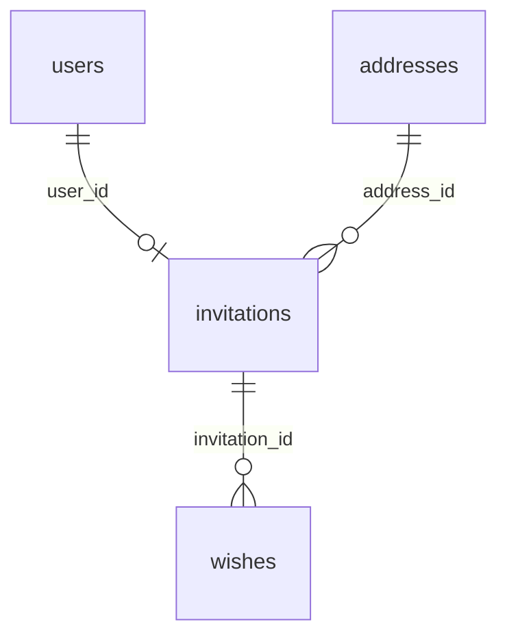

# Wedding invitation data model

Created: 2026-10-05. Scope: backend data structures using Prisma and PostgreSQL. This is a design document; it does not change the schema or run a migration.

## 1. Confirmed requirements

- The app serves one wedding and has a small scope.
- Each invitation belongs to one guest. A guest can have only one invitation.
- A `user` is an invited guest, not an admin account. An admin enters the guest details when sending an invitation; guests do not sign in.
- An invitation has an automatically generated CUID string `id` and an automatically generated unique `code`. Admins cannot change these identifiers.
- Guests find their invitation by `code`.
- `status` is a **`String`** that represents the invitation state, including attendance confirmation. Do not use a database enum or add an `is_attending` field with overlapping meaning.
- `guest_count` stores the total number of attendees, including the invited guest, rather than only additional guests.
- Each invitation references exactly one address. The current wedding has two venues on different dates, stored as two address records; the event date and time live on the address.
- An invitation can have many wishes. A guest can submit multiple wishes; someone without an invitation cannot submit one.
- An invitation has `created_at`, `updated_at`, and `expires_at`; `expires_at` is required.
- Users and invitations use soft deletion. Addresses and wishes do not.
- Every foreign key must explicitly define both `onUpdate` and `onDelete`.
- All field names, including Prisma relation fields, use snake_case.
- Presentation, APIs, and admin accounts are outside this document's scope.

The detailed field names, contact and guest-count nullability, native types, indexes, and referential actions below are **technical proposals**, not separately confirmed business requirements. The allowed values and default value for `status` have not been decided.

## 2. Tables and relationships

| Proposed model | Database table | Purpose |
| --- | --- | --- |
| `User` | `users` | Invited guest details |
| `Address` | `addresses` | Venue and event date/time |
| `Invitation` | `invitations` | A guest's invitation, status, and attendee count |
| `Wish` | `wishes` | Wishes submitted through an invitation |

- Every invitation must belong to one user and one address.
- `invitations.user_id` has a unique constraint, so a user can have at most one invitation, including soft-deleted invitations.
- Many invitations can reference one address. There is no invitation-address join table because each invitation selects only one address.
- An invitation can have zero or more wishes; every wish must belong to one invitation.
- The diagram allows a user to exist without an invitation while data is being entered. A foreign key plus a unique constraint cannot ensure that every user always has an invitation.
- The two addresses are current data, not a database record limit. This scope does not need a wedding or event table.

## 3. Data type conventions

The tables below use Prisma type names. A `String` is expected to use PostgreSQL `text`; no length limit is added without a requirement.

All timestamps should use `DateTime` with the PostgreSQL native type `timestamptz(3)`, represented by `@db.Timestamptz(3)`. Do not infer the wedding time zone from a developer machine's time zone. [Prisma Schema API v7 — DateTime](https://docs.prisma.io/docs/orm/v7/reference/prisma-schema-reference#datetime).

`created_at` records the creation time. Prisma manages CUID values and `updated_at`; direct SQL does not automatically receive either behavior. [Prisma Schema API v7 — cuid](https://docs.prisma.io/docs/orm/v7/reference/prisma-schema-reference#cuid), [updatedAt](https://docs.prisma.io/docs/orm/v7/reference/prisma-schema-reference#updatedat).

## 4. Field details

### 4.1. `users`

| Field | Type | Nullable | Default / constraint | Meaning |
| --- | --- | --- | --- | --- |
| `id` | `String` | No | Generated CUID; primary key | Guest identifier |
| `full_name` | `String` | No | No default | Guest name entered by an admin |
| `phone_number` | `String` | Yes | `null` | Phone number; text preserves `+` and leading zeroes |
| `email` | `String` | Yes | `null` | Guest email address |
| `created_at` | `DateTime` | No | Creation time | Record creation timestamp |
| `updated_at` | `DateTime` | No | Updated automatically by Prisma | Record update timestamp |
| `deleted_at` | `DateTime` | Yes | `null` | Set when the guest is soft deleted |

`phone_number` and `email` should be nullable so neither contact method is required. Names, phone numbers, and email addresses are not unique because they are not confirmed guest identifiers. Do not add other profile fields or metadata until a concrete need appears.

Proposed relation field: `invitation` with type `Invitation?`; it creates no database column.

### 4.2. `addresses`

| Field | Type | Nullable | Default / constraint | Meaning |
| --- | --- | --- | --- | --- |
| `id` | `String` | No | Generated CUID; primary key | Venue identifier |
| `name` | `String` | No | No default | Venue name |
| `address_text` | `String` | No | No default | Full address |
| `event_at` | `DateTime` | No | No default | Event date and time at this venue |
| `created_at` | `DateTime` | No | Creation time | Record creation timestamp |
| `updated_at` | `DateTime` | No | Updated automatically by Prisma | Record update timestamp |

There is no `deleted_at`. Enter the two venues and dates as separate records; do not hardcode their dates or names into the schema. Neither `event_at` nor the address text is unique.

The event date and time live only on the address and are not copied to an invitation. Because this is a direct relationship, updating an address changes the source data for every invitation that references it. The model does not keep a per-invitation venue snapshot.

Proposed relation field: `invitations` with type `Invitation[]`; it creates no database column.

### 4.3. `invitations`

| Field | Type | Nullable | Default / constraint | Meaning |
| --- | --- | --- | --- | --- |
| `id` | `String` | No | Generated CUID; primary key | Stable internal key |
| `code` | `String` | No | Generated; unique | Code used to find the invitation |
| `user_id` | `String` | No | FK to `users.id`; unique | Invited guest |
| `address_id` | `String` | No | FK to `addresses.id` | Selected venue and event date |
| `status` | **`String`** | No | No enum; no default yet | Invitation and attendance state |
| `guest_count` | `Int` | Yes | `null`; proposed nonnegative value | Total attendees, including the invited guest |
| `created_at` | `DateTime` | No | Creation time | Invitation creation timestamp |
| `updated_at` | `DateTime` | No | Updated automatically by Prisma | Invitation update timestamp |
| `expires_at` | `DateTime` | No | No default; required | Expiration time |
| `deleted_at` | `DateTime` | Yes | `null` | Set when the invitation is soft deleted |

`guest_count` should be nullable until an attendee count is recorded. Do not default it to the demo RSVP value of `1` or impose an unrequested maximum. Do not create a CHECK that ties `guest_count` to a particular `status`, because the application owns the status values.

Confirmed counting rule: a guest attending alone is `1`, and a guest attending with one other person is `2`. A value of `0` means nobody is attending; `null` means no count has been recorded and is distinct from `0`.

`expires_at` is independent of `event_at`; do not derive an invitation deadline from the event date. Do not add viewed, published, or responded timestamps without a requirement.

Use `id` as the relationship key and keep `code` as a separate unique lookup key. The database must enforce uniqueness for `code`, even if another layer generates it. Code generation algorithm, length, and format are outside this plan. Do not use a sequential code or integer primary key.

The requirement that `id` and `code` cannot change is a data invariant. Primary key and unique constraints ensure uniqueness but do not prevent these values from being updated.

Proposed relation fields: `user` (`User`), `address` (`Address`), and `wishes` (`Wish[]`).

### 4.4. `wishes`

| Field | Type | Nullable | Default / constraint | Meaning |
| --- | --- | --- | --- | --- |
| `id` | `String` | No | Generated CUID; primary key | Wish identifier |
| `invitation_id` | `String` | No | FK to `invitations.id`; not unique | Invitation that owns the wish |
| `content` | `String` | No | No default | Wish content |
| `created_at` | `DateTime` | No | Creation time | Wish creation timestamp |
| `updated_at` | `DateTime` | No | Updated automatically by Prisma | Wish update timestamp |

There is no `deleted_at`. `invitation_id` is not unique, allowing an invitation to have many wishes.

Conditional proposal: do not store another `user_id` on a wish if `invitations.user_id` remains immutable after creation. Derive the sender through `wishes.invitation_id` → `invitations.user_id` → `users.id`. This avoids storing two links that could identify different guests. It is a link to the user through the invitation, not an additional direct foreign key. If invitations can be reassigned, authorship storage must change as described in section 9.1; this rule still needs confirmation.

The required foreign key prevents a wish without an invitation or a reference to a missing invitation. It does not verify the actor's identity, check whether an invitation is soft deleted or expired, or interpret `status`.

Proposed relation field: `invitation` with type `Invitation`.

## 5. Referential actions

**Proposed policy:** explicitly use `onUpdate: Cascade` and `onDelete: Restrict` on all three foreign keys. The soft and hard deletion behavior of each table is confirmed, but the specific `Cascade` and `Restrict` choices are not; treat this policy as a proposal.

| Foreign key | Reference | `on_update` | `on_delete` | Result when the parent is hard deleted |
| --- | --- | --- | --- | --- |
| `invitations.user_id` | `users.id` | `Cascade` | `Restrict` | Block deletion while invitations reference the guest |
| `invitations.address_id` | `addresses.id` | `Cascade` | `Restrict` | Block deletion while invitations reference the address |
| `wishes.invitation_id` | `invitations.id` | `Cascade` | `Restrict` | Block deletion while wishes reference the invitation |

`Restrict` preserves referenced data; `Cascade` updates a foreign key if the referenced key changes. Deleting a wish does not delete its invitation or user. [Prisma v7 — Referential actions](https://docs.prisma.io/docs/orm/v7/prisma-schema/data-model/relations/referential-actions).

Place `onUpdate` and `onDelete` on the three relations that own foreign keys: `Invitation.user`, `Invitation.address`, and `Wish.invitation`. Do not repeat actions on inverse relations. These are fixed Prisma arguments, not fields that should use snake_case. [Prisma Schema API v7 — relation](https://docs.prisma.io/docs/orm/v7/reference/prisma-schema-reference#relation).

## 6. Soft deletion and relationship preservation

| Table | Deletion method | Supporting field |
| --- | --- | --- |
| `users` | Soft delete | `deleted_at` |
| `invitations` | Soft delete | `deleted_at` |
| `addresses` | Hard delete, subject to FK constraints | No `deleted_at` |
| `wishes` | Hard delete | No `deleted_at` |

A soft delete updates `deleted_at`; it does not delete the record. Therefore, `onDelete` does not run and does not soft delete child records.

Relationships remain intact when a guest or invitation is soft deleted. There is no requirement to soft delete an invitation when its user is soft deleted or to delete wishes when an invitation is soft deleted, so this plan does not add those rules.

Unique constraints on `user_id` and `code` include soft-deleted records. Soft deleting an invitation does not allow another invitation for the same guest or reuse of its code. Do not use a partial unique index limited to active records because the requirement is one invitation per guest.

With the proposed `Restrict` policy, an address still cannot be hard deleted while a soft-deleted invitation references it. A soft-deleted record still exists in the database.

## 7. Minimum constraints and indexes

| Location | Constraint / index | Purpose |
| --- | --- | --- |
| `id` on all four tables | Primary key | Unique identification |
| `invitations.code` | Unique | Prevent duplicate invitation codes |
| `invitations.user_id` | Unique + FK | At most one invitation per guest |
| `invitations.address_id` | FK + index | Link to and query by address |
| `wishes.invitation_id` | FK + index | Link to and query wishes by invitation |
| `invitations.guest_count` | Proposed nonnegative CHECK when present | Prevent negative counts while allowing `null` |
| Required fields in section 4 | NOT NULL | Ensure required keys, status, and timestamps exist |

Primary key and unique constraints create their corresponding PostgreSQL indexes, so do not add duplicate indexes for `id`, `code`, or `user_id`. Foreign keys do not automatically index their referencing columns; add separate indexes for `address_id` and `invitation_id`. [PostgreSQL — Constraints](https://www.postgresql.org/docs/current/ddl-constraints.html).

Do not index every timestamp, contact field, or `status` without a query requirement. Do not add a database enum, allowed-value list, or CHECK for `status`.

## 8. Comparison with the current repository

The repository currently uses Prisma 7.10.0, PostgreSQL, and a standalone `Rsvp` model. That model uses an attendance enum and several camelCase fields; the RSVP repository currently holds in-memory demo data.

In the new design, attendance state and attendee count live on `invitations.status` and `invitations.guest_count`; wishes live on `wishes`. The confirmed requirements do not need a separate RSVP table.

This document does not decide whether to migrate, retain, or drop the existing `rsvps` table. Inspect the real database before implementation; do not assume it is empty because the repository has no migrations directory. New fields use snake_case directly in Prisma and the database, rather than mapping snake_case columns while keeping camelCase Prisma fields.

The following remain proposals for review before implementation: nullability of `phone_number`, `email`, and `guest_count`; the attendee-count CHECK; the native timestamp type; and the referential-action policy in section 5. This planning step makes no schema, migration, API, or frontend changes.

## 9. Open issues review

Reviewed: 2026-10-05. The four tables satisfy the confirmed scope, and no additional attendance table or field is currently needed. The issues below are limits to clarify or proposed constraints; they are not new requirements.

### 9.1. Reassigning an invitation can misattribute wishes

Wishes currently derive their sender through `invitations.user_id`. For example, if an invitation originally belongs to guest A, A submits a wish, and the invitation's `user_id` is later changed to B, the old wish appears to belong to B even though the wish record was never updated. The foreign key and unique constraint remain valid in this case.

Choose one of these approaches before implementation:

- Keep the invitation recipient immutable after creation. The current model is then sufficient and wishes need no separate author foreign key.
- Allow reassignment. Store the sender independently on `wishes`, such as a `user_id` referencing `users.id`, so reassignment does not change historical authorship. The additional foreign key must define both referential actions. Ensuring that the sender matches the invitation guest when submitting is a separate invariant; do not use a cascade to rewrite historical authorship.

The reassignment rule is unconfirmed. Do not add `wishes.user_id` to the primary design yet.

### 9.2. Soft deletion does not define validity rules for related data

A soft-deleted user can still have an invitation with `deleted_at = null`, and a new wish can still reference a soft-deleted invitation. Both are valid under foreign keys alone because the parent record still exists.

Proposed backend invariant: do not create new interaction data for a soft-deleted user or invitation; preserve existing relationships and wishes. Do not add cascading soft deletion without a requirement. Enforcing this invariant in the database for every writer requires a separate mechanism; a foreign key or a CHECK on the wish record cannot inspect parent-record state.

Requiring `expires_at` only ensures that an expiration time exists. It does not change `status` or reject writes automatically. Whether expiration prevents wishes is unconfirmed, so do not infer a new constraint.

### 9.3. NOT NULL does not guarantee meaningful content

The plan does not prevent empty guest names, addresses, codes, or wishes. Add nonempty-content requirements for `users.full_name`, `addresses.name`, `addresses.address_text`, `invitations.code`, and `wishes.content`; handle whitespace-only values consistently. `status` remains a `String`, without an allowed-value list or database enum.

Consider requiring `expires_at > created_at` if invitations must always be created before their expiration time. Only the presence of `expires_at` is confirmed, not this ordering rule. Retain the proposed nonnegative `guest_count` CHECK from section 7.

PostgreSQL supports CHECK constraints over values in the same record. A CHECK runs when data is written and is not reevaluated as time passes, so do not use a current-time-dependent CHECK to expire invitations automatically. [PostgreSQL — Check constraints](https://www.postgresql.org/docs/current/ddl-constraints.html#DDL-CONSTRAINTS-CHECK-CONSTRAINTS).

In the repository's Prisma v7 version, CHECK constraints have no Prisma schema representation and are not generated by Migrate. If these checks are selected, add them to the SQL migration. This distinction prevents an implementation from changing only the schema and assuming the database has every constraint. [Prisma v7 — Database features](https://www.prisma.io/docs/orm/v7/reference/database-features), [customized migrations](https://www.prisma.io/docs/orm/v7/prisma-migrate/workflows/unsupported-database-features).

### 9.4. The database does not enforce identifier immutability

A primary-key `id` and unique `code` can still be updated. The proposed `onUpdate: Cascade` policy propagates parent-key changes to foreign keys rather than preventing them. Changing `invitations.user_id` to another valid user changes a relationship, not the user's primary key; the foreign key's `onUpdate` action does not prevent it.

Distinguish the rule that admins cannot edit identifiers from a database rule that blocks every writer from changing them. Database enforcement requires an appropriate write-permission policy or trigger. `onUpdate: Restrict` could block changes to referenced parent keys, but it still would not prevent changing `code`, changing an unreferenced key, or reassigning an invitation's `user_id`. This is not sufficient reason to change every action in section 5 automatically. [Prisma v7 — Referential actions](https://docs.prisma.io/docs/orm/v7/prisma-schema/data-model/relations/referential-actions).

### 9.5. A unique code is not necessarily difficult to guess

Inference from guests not signing in: if `code` is the only requirement for finding an invitation and submitting a wish, knowing the code may grant access to that invitation. A unique constraint prevents duplicates but does not make codes unpredictable or verify that the caller is the invited guest.

Generated codes should be cryptographically difficult to guess if they act as access credentials. This data-model review does not specify a length or algorithm; retain unpredictability as a criterion when selecting the generator. [OWASP — Token entropy and randomness](https://cheatsheetseries.owasp.org/cheatsheets/Session_Management_Cheat_Sheet.html#session-id-entropy).

### 9.6. Limits that fit the current scope

- Unique `user_id` ensures one invitation per guest record, including soft-deleted records. To reuse an invitation for that guest, restore the existing record instead of creating a replacement around the unique constraint.
- An address can be hard deleted only when no invitation references it, including soft-deleted invitations. This is an effect of `Restrict`, not a foreign-key defect.
- An invitation has one venue and one attendee count. The model does not store separate responses for each date or venue because the confirmed scope assigns one address to each invitation.
