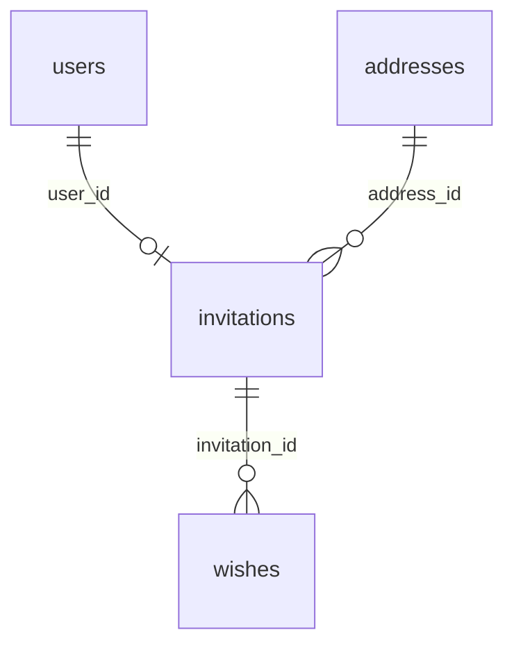

# Data model cho thiệp cưới

Ngày lập: 2026-10-05. Phạm vi: cấu trúc dữ liệu backend trên Prisma + PostgreSQL. Đây là tài liệu thiết kế; chưa thay đổi schema hoặc chạy migration.

## 1. Yêu cầu đã xác nhận

- App phục vụ một đám cưới, scope nhỏ.
- Mỗi invitation dành cho một khách. Một khách chỉ có một invitation.
- `user` là khách được mời, không phải tài khoản admin. Thông tin khách do admin nhập khi gửi thiệp; khách không đăng nhập.
- Invitation có `id` string CUID tự sinh và `code` tự sinh, unique. Admin không đổi các định danh này.
- Khách tìm thiệp qua `code`.
- `status` có kiểu **`String`**, dùng để biểu thị trạng thái thiệp, bao gồm xác nhận tham gia. Không dùng enum ở DB, không thêm `is_attending` hoặc field xác nhận trùng nghĩa.
- `guest_count` lưu tổng số người đi, gồm cả khách nhận thiệp; không chỉ đếm người đi thêm.
- Mỗi invitation liên kết đúng một address. Hiện có hai địa điểm vào hai ngày khác nhau, lưu thành hai record address; ngày/giờ tổ chức nằm trên address.
- Một invitation có nhiều lời chúc. Một người có thể gửi nhiều lời chúc; người không có thiệp không được gửi.
- Invitation có `created_at`, `updated_at`, `expires_at`; `expires_at` bắt buộc.
- User và invitation soft delete. Address và lời chúc không soft delete.
- Mọi foreign key phải ghi rõ cả `onUpdate` và `onDelete`.
- Tất cả tên field, kể cả relation field trong Prisma, dùng snake_case.
- Phần hiển thị, API và tài khoản admin nằm ngoài phạm vi tài liệu.

Các lựa chọn về tên field chi tiết, nullability của thông tin liên hệ/số người đi, native type, indexes và referential actions bên dưới là **đề xuất kỹ thuật**, không phải yêu cầu nghiệp vụ đã được xác nhận riêng. Chưa chốt danh sách giá trị hoặc giá trị mặc định của `status`.

## 2. Các bảng và quan hệ

| Model dự kiến | Bảng DB | Vai trò |
| --- | --- | --- |
| `User` | `users` | Thông tin khách được mời |
| `Address` | `addresses` | Địa điểm và ngày/giờ tổ chức |
| `Invitation` | `invitations` | Thiệp riêng của khách, trạng thái và số người đi |
| `Wish` | `wishes` | Các lời chúc gửi qua thiệp |

- Mỗi invitation bắt buộc thuộc một user và một address.
- `invitations.user_id` có unique constraint: một user có tối đa một invitation, kể cả invitation đã soft delete.
- Một address được nhiều invitation tham chiếu. Không có bảng nối invitation–address vì mỗi thiệp chỉ chọn một address.
- Một invitation có từ không đến nhiều lời chúc; mỗi lời chúc bắt buộc thuộc một invitation.
- Diagram cho phép user chưa có thiệp trong quá trình nhập dữ liệu. FK + unique không bảo đảm mọi user luôn có sẵn một invitation.
- Hai address là dữ liệu hiện tại, không phải giới hạn số record ở DB. Không thêm bảng đám cưới hay bảng sự kiện cho scope này.

## 3. Quy ước kiểu dữ liệu

Các bảng bên dưới dùng tên kiểu Prisma. `String` dự kiến lưu bằng PostgreSQL `text`, không tự đặt giới hạn độ dài khi chưa có yêu cầu.

Đề xuất tất cả timestamp dùng `DateTime` với native type PostgreSQL `timestamptz(3)`, tương ứng `@db.Timestamptz(3)`. Không suy ra múi giờ đám cưới từ múi giờ máy phát triển. [Prisma Schema API v7 — DateTime](https://docs.prisma.io/docs/orm/v7/reference/prisma-schema-reference#datetime).

`created_at` lấy thời điểm tạo. CUID và `updated_at` do Prisma quản lý; SQL trực tiếp không tự hưởng hai cơ chế này. [Prisma Schema API v7 — cuid](https://docs.prisma.io/docs/orm/v7/reference/prisma-schema-reference#cuid), [updatedAt](https://docs.prisma.io/docs/orm/v7/reference/prisma-schema-reference#updatedat).

## 4. Chi tiết fields

### 4.1. `users`

| Field | Kiểu | Nullable | Default / constraint | Ý nghĩa |
| --- | --- | --- | --- | --- |
| `id` | `String` | Không | CUID tự sinh; primary key | Định danh khách |
| `full_name` | `String` | Không | Không default | Tên khách do admin nhập |
| `phone_number` | `String` | Có | `null` | Số điện thoại; giữ dạng text để bảo toàn dấu `+` và số `0` đầu |
| `email` | `String` | Có | `null` | Email khách |
| `created_at` | `DateTime` | Không | Thời điểm tạo | Mốc tạo record |
| `updated_at` | `DateTime` | Không | Tự cập nhật qua Prisma | Mốc cập nhật record |
| `deleted_at` | `DateTime` | Có | `null` | Có giá trị khi khách đã soft delete |

Đề xuất `phone_number` và `email` nullable để không bắt buộc có cả hai loại thông tin liên hệ. Không đặt unique cho tên, số điện thoại hoặc email vì chưa có yêu cầu dùng chúng làm định danh khách. Chưa bổ sung field thông tin khác hoặc metadata khi chưa có nhu cầu cụ thể.

Relation field dự kiến: `invitation`, kiểu `Invitation?`; không tạo cột trên DB.

### 4.2. `addresses`

| Field | Kiểu | Nullable | Default / constraint | Ý nghĩa |
| --- | --- | --- | --- | --- |
| `id` | `String` | Không | CUID tự sinh; primary key | Định danh địa điểm |
| `name` | `String` | Không | Không default | Tên địa điểm |
| `address_text` | `String` | Không | Không default | Địa chỉ đầy đủ |
| `event_at` | `DateTime` | Không | Không default | Ngày/giờ tổ chức tại địa điểm này |
| `created_at` | `DateTime` | Không | Thời điểm tạo | Mốc tạo record |
| `updated_at` | `DateTime` | Không | Tự cập nhật qua Prisma | Mốc cập nhật record |

Không có `deleted_at`. Hai địa điểm/ngày tổ chức được nhập thành hai record riêng; không hardcode ngày hoặc tên địa điểm vào schema. Không đặt unique cho `event_at` hoặc nội dung địa chỉ.

Ngày/giờ chỉ lưu trên address, không sao chép vào invitation. Vì đây là quan hệ trực tiếp, cập nhật address sẽ cập nhật nguồn dữ liệu của tất cả invitation đang tham chiếu; model này không lưu snapshot địa điểm trên từng thiệp.

Relation field dự kiến: `invitations`, kiểu `Invitation[]`; không tạo cột trên DB.

### 4.3. `invitations`

| Field | Kiểu | Nullable | Default / constraint | Ý nghĩa |
| --- | --- | --- | --- | --- |
| `id` | `String` | Không | CUID tự sinh; primary key | Khóa nội bộ ổn định |
| `code` | `String` | Không | Tự sinh; unique | Mã dùng để tìm thiệp |
| `user_id` | `String` | Không | FK tới `users.id`; unique | Khách nhận thiệp |
| `address_id` | `String` | Không | FK tới `addresses.id` | Địa điểm/ngày tổ chức được chọn |
| `status` | **`String`** | Không | Không enum; chưa đặt default | Trạng thái thiệp và xác nhận tham gia |
| `guest_count` | `Int` | Có | `null`; đề xuất giá trị không âm | Tổng số người đi, gồm cả khách nhận thiệp |
| `created_at` | `DateTime` | Không | Thời điểm tạo | Mốc tạo thiệp |
| `updated_at` | `DateTime` | Không | Tự cập nhật qua Prisma | Mốc cập nhật thiệp |
| `expires_at` | `DateTime` | Không | Không default; bắt buộc cung cấp | Thời điểm hết hạn |
| `deleted_at` | `DateTime` | Có | `null` | Có giá trị khi thiệp đã soft delete |

Đề xuất `guest_count` nullable khi chưa ghi nhận số người đi; không mặc định là `1` theo RSVP demo và không tự đặt giới hạn tối đa. Không thiết kế CHECK liên kết `guest_count` với một giá trị `status` cụ thể vì danh sách status do bạn tự quản lý.

Quy ước đếm đã xác nhận: khách đi một mình là `1`, khách cùng một người nữa là `2`. Giá trị `0` là không có người đi; `null` là chưa ghi nhận số lượng, không đồng nghĩa với `0`.

`expires_at` độc lập với `event_at`: không tự suy ra hạn thiệp từ ngày tổ chức. Không thêm mốc đã xem, đã phát hành hoặc đã trả lời khi chưa có yêu cầu.

Giữ `id` làm khóa cho các quan hệ; `code` là khóa tra cứu unique riêng. DB phải có unique constraint cho `code`, kể cả khi mã được tạo từ tầng khác. Thuật toán, độ dài và format của code không nằm trong plan này. Không dùng mã tăng dần hoặc integer làm primary key.

Yêu cầu không đổi `id`/`code` là invariant của dữ liệu. Primary key và unique constraint bảo đảm tính duy nhất, không tự ngăn việc UPDATE các giá trị này.

Relation fields dự kiến: `user` (`User`), `address` (`Address`), `wishes` (`Wish[]`).

### 4.4. `wishes`

| Field | Kiểu | Nullable | Default / constraint | Ý nghĩa |
| --- | --- | --- | --- | --- |
| `id` | `String` | Không | CUID tự sinh; primary key | Định danh lời chúc |
| `invitation_id` | `String` | Không | FK tới `invitations.id`; không unique | Thiệp mà lời chúc thuộc về |
| `content` | `String` | Không | Không default | Nội dung lời chúc |
| `created_at` | `DateTime` | Không | Thời điểm tạo | Mốc tạo lời chúc |
| `updated_at` | `DateTime` | Không | Tự cập nhật qua Prisma | Mốc cập nhật lời chúc |

Không có `deleted_at`. `invitation_id` không unique để một invitation có nhiều lời chúc.

Đề xuất có điều kiện: không lưu thêm `user_id` trên lời chúc nếu `invitations.user_id` được giữ bất biến sau khi tạo. Người gửi được suy ra từ `wishes.invitation_id` → `invitations.user_id` → `users.id`. Cách này tránh lưu hai liên kết có thể trỏ tới hai khách khác nhau. Đây là liên kết với user thông qua invitation, không phải một FK trực tiếp bổ sung. Nếu cho phép chuyển thiệp sang khách khác, cần điều chỉnh cách lưu tác giả như mục 9.1; quy tắc này đang chờ xác nhận.

FK bắt buộc bảo đảm không tồn tại lời chúc thiếu invitation hoặc tham chiếu invitation không tồn tại. FK không xác minh danh tính người thực hiện thao tác, không kiểm tra thiệp đã soft delete/hết hạn và không diễn giải `status`.

Relation field dự kiến: `invitation`, kiểu `Invitation`.

## 5. Referential actions

**Policy đề xuất:** ghi rõ `onUpdate: Cascade`, `onDelete: Restrict` trên cả ba foreign key. Bạn đã xác nhận loại soft/hard delete của từng bảng, nhưng chưa xác nhận riêng lựa chọn `Cascade`/`Restrict`; không xem policy này là yêu cầu đã chốt.

| Foreign key | Reference | `on_update` | `on_delete` | Hệ quả khi hard delete record cha |
| --- | --- | --- | --- | --- |
| `invitations.user_id` | `users.id` | `Cascade` | `Restrict` | Chặn xóa khách nếu còn invitation tham chiếu |
| `invitations.address_id` | `addresses.id` | `Cascade` | `Restrict` | Chặn xóa address nếu còn invitation tham chiếu |
| `wishes.invitation_id` | `invitations.id` | `Cascade` | `Restrict` | Chặn xóa invitation nếu còn lời chúc tham chiếu |

`Restrict` bảo toàn dữ liệu còn được tham chiếu; `Cascade` ở chiều update cập nhật FK nếu khóa được tham chiếu thay đổi. Việc xóa một lời chúc không xóa invitation hoặc user. [Prisma v7 — Referential actions](https://docs.prisma.io/docs/orm/v7/prisma-schema/data-model/relations/referential-actions).

Đặt `onUpdate`/`onDelete` tại ba relation sở hữu FK: `Invitation.user`, `Invitation.address`, `Wish.invitation`. Các relation ngược không khai báo lặp actions. Đây là tham số cố định của Prisma, không phải field để đổi sang snake_case. [Prisma Schema API v7 — relation](https://docs.prisma.io/docs/orm/v7/reference/prisma-schema-reference#relation).

## 6. Soft delete và bảo toàn quan hệ

| Bảng | Cách xóa | Field hỗ trợ |
| --- | --- | --- |
| `users` | Soft delete | `deleted_at` |
| `invitations` | Soft delete | `deleted_at` |
| `addresses` | Hard delete, chịu FK constraint | Không có `deleted_at` |
| `wishes` | Hard delete | Không có `deleted_at` |

Soft delete là cập nhật `deleted_at`, không phải DELETE record. Vì vậy `onDelete` không tự chạy và không tự soft delete các record con.

Các quan hệ vẫn được giữ khi khách hoặc thiệp soft delete. Chưa có yêu cầu tự soft delete invitation khi user soft delete, hoặc tự xóa lời chúc khi invitation soft delete; plan không bổ sung các quy tắc đó.

Unique constraint trên `user_id` và `code` áp dụng cả record đã soft delete. Soft delete một thiệp không cho phép tạo thiệp thứ hai cho cùng khách hoặc tái sử dụng code cũ. Không dùng partial unique index chỉ dành cho record chưa xóa, vì yêu cầu là một khách chỉ một thiệp.

Với policy `Restrict` đề xuất, address vẫn bị chặn hard delete nếu invitation đã soft delete còn tham chiếu tới nó. Record soft delete vẫn tồn tại ở DB.

## 7. Constraints và indexes tối thiểu

| Vị trí | Constraint / index | Mục đích |
| --- | --- | --- |
| `id` của cả bốn bảng | Primary key | Định danh unique |
| `invitations.code` | Unique | Không trùng mã thiệp |
| `invitations.user_id` | Unique + FK | Một khách tối đa một thiệp |
| `invitations.address_id` | FK + index | Liên kết tới address và hỗ trợ truy vấn theo địa điểm |
| `wishes.invitation_id` | FK + index | Liên kết và truy vấn lời chúc theo thiệp |
| `invitations.guest_count` | Đề xuất CHECK không âm khi có giá trị | Tránh số người âm; vẫn cho phép `null` |
| Các field bắt buộc ở mục 4 | NOT NULL | Bảo đảm có đủ khóa, status và timestamps bắt buộc |

Primary key và unique constraint đã tạo index tương ứng trong PostgreSQL; không thêm index trùng cho `id`, `code` hoặc `user_id`. FK không tự tạo index trên cột tham chiếu, nên đề xuất hai index riêng cho `address_id` và `invitation_id`. [PostgreSQL — Constraints](https://www.postgresql.org/docs/current/ddl-constraints.html).

Chưa cần index cho mọi timestamp, thông tin liên hệ hoặc `status` khi chưa có nhu cầu truy vấn cụ thể. Không thêm DB enum, danh sách giá trị hợp lệ hoặc CHECK cho `status`.

## 8. Đối chiếu với repo hiện tại

Repo hiện có Prisma 7.10.0, PostgreSQL và model `Rsvp` độc lập. Model này dùng enum attendance cùng một số field camelCase; repository RSVP đang là dữ liệu demo trong bộ nhớ.

Trong thiết kế mới, xác nhận tham gia và số người đi nằm trên `invitations.status` / `invitations.guest_count`; lời chúc nằm trên `wishes`. Không cần thêm bảng RSVP cho các yêu cầu đã chốt.

Tài liệu này chưa quyết định migrate, giữ hay drop bảng `rsvps` hiện có. Trước khi triển khai cần kiểm tra dữ liệu DB thực tế; không suy ra DB trống chỉ vì repo chưa có thư mục migrations. Tên field mới dùng snake_case trực tiếp trong Prisma và DB, không chỉ map cột DB sang snake_case trong khi giữ field camelCase.

Các điểm còn ở mức đề xuất để review trước khi triển khai: nullability của `phone_number`, `email`, `guest_count`; CHECK cho số người; native timestamp type; và policy referential actions tại mục 5. Không có thay đổi schema, migration, API hoặc frontend trong bước lập plan này.

## 9. Rà soát các điểm còn hở

Rà soát ngày 2026-10-05. Bốn bảng hiện tại đáp ứng scope đã xác nhận; chưa thấy nhu cầu thêm bảng hoặc field xác nhận tham gia. Các điểm dưới đây là giới hạn cần làm rõ hoặc đề xuất ràng buộc, chưa tự chuyển thành yêu cầu mới.

### 9.1. Có thể gán sai người gửi lời chúc nếu chuyển thiệp sang khách khác

Hiện `wishes` suy ra người gửi qua `invitations.user_id`. Ví dụ thiệp ban đầu thuộc khách A, A đã gửi lời chúc, sau đó `user_id` của thiệp được chuyển sang B: lời chúc cũ sẽ bị gán cho B dù `wishes` không hề được sửa. FK và unique constraint vẫn hợp lệ trong trường hợp này.

Cần chốt một trong hai hướng trước khi triển khai:

- Giữ nguyên khách nhận thiệp sau khi tạo: coi `invitations.user_id` là bất biến. Khi đó mô hình hiện tại đủ, không cần thêm FK tác giả trên lời chúc.
- Cho phép chuyển thiệp sang khách khác: cần lưu người gửi độc lập trên `wishes`, ví dụ `user_id` tham chiếu `users.id`, để việc chuyển thiệp không đổi tác giả các lời chúc cũ. FK bổ sung phải ghi rõ cả referential actions. Việc kiểm tra người gửi khớp với khách của thiệp tại lúc gửi là một invariant riêng; không dùng cascade để đổi tác giả lịch sử.

Quy tắc chuyển thiệp chưa được xác nhận. Không tự thêm `wishes.user_id` vào thiết kế chính.

### 9.2. Soft delete chưa có quy tắc về tính hợp lệ của dữ liệu liên quan

User đã soft delete vẫn có thể có invitation với `deleted_at = null`; invitation đã soft delete vẫn có thể được một lời chúc mới tham chiếu. Đây đều là dữ liệu hợp lệ xét riêng theo FK, vì record cha vẫn tồn tại.

Đề xuất invariant khi triển khai backend: không tạo dữ liệu tương tác mới cho user hoặc invitation đã soft delete; giữ các liên kết và lời chúc cũ để bảo toàn dữ liệu. Chưa tự thêm cơ chế cascade soft delete. Nếu cần bảo đảm invariant này ở DB cho mọi nguồn ghi, phải có cơ chế riêng; FK hoặc CHECK trên riêng record lời chúc không kiểm tra được trạng thái record cha.

`expires_at` bắt buộc chỉ bảo đảm có thời điểm hết hạn, không tự đổi `status` hoặc tự chặn ghi dữ liệu. Quy tắc hết hạn có áp dụng cho lời chúc hay không chưa được xác nhận; không suy diễn thành một constraint mới.

### 9.3. NOT NULL chưa đủ để bảo đảm nội dung có giá trị

Plan hiện chưa chặn tên, địa chỉ, code hoặc lời chúc là chuỗi rỗng. Đề xuất bổ sung yêu cầu nội dung không rỗng cho `users.full_name`, `addresses.name`, `addresses.address_text`, `invitations.code`, `wishes.content`; quy tắc xử lý chuỗi chỉ có khoảng trắng cần nhất quán. `status` vẫn là `String` theo yêu cầu, không thêm danh sách giá trị hoặc DB enum.

Đề xuất thêm ràng buộc `expires_at > created_at` nếu thiệp luôn phải được tạo trước thời điểm hết hạn. Hiện chỉ xác nhận `expires_at` bắt buộc, chưa xác nhận điều kiện thứ tự này. Giữ đề xuất CHECK `guest_count` không âm ở mục 7.

PostgreSQL hỗ trợ CHECK trên các giá trị cùng record; CHECK chỉ được kiểm tra khi ghi, không tự chạy lại khi thời gian trôi qua. Vì vậy không dùng CHECK phụ thuộc thời gian hiện tại để coi thiệp tự hết hạn. [PostgreSQL — Check constraints](https://www.postgresql.org/docs/current/ddl-constraints.html#DDL-CONSTRAINTS-CHECK-CONSTRAINTS).

Với Prisma v7 trong repo, CHECK chưa có biểu diễn trong Prisma schema và chưa được tự sinh bởi Migrate; nếu chọn các CHECK trên, cần ghi chúng vào SQL migration. Ghi rõ phần này để tránh triển khai chỉ schema rồi tưởng DB đã có đủ constraints. [Prisma v7 — Database features](https://www.prisma.io/docs/orm/v7/reference/database-features), [customized migrations](https://www.prisma.io/docs/orm/v7/prisma-migrate/workflows/unsupported-database-features).

### 9.4. Các định danh chưa được bảo đảm bất biến ở DB

`id` là primary key, `code` là unique vẫn có thể được UPDATE. Policy `onUpdate: Cascade` hiện đề xuất sẽ truyền thay đổi khóa cha xuống FK, không chặn thay đổi đó. Còn thay `invitations.user_id` sang một user hợp lệ khác là thay liên kết, không phải thay primary key của user; `onUpdate` trên FK không tự ngăn việc này.

Cần phân biệt yêu cầu admin không được chỉnh các định danh với yêu cầu DB phải cấm mọi nguồn ghi đổi chúng. Nếu chọn bảo đảm ở DB, cần policy quyền ghi hoặc trigger phù hợp. Có thể cân nhắc `onUpdate: Restrict` để chặn thay khóa cha đang được tham chiếu, nhưng cách này vẫn không chặn đổi `code`, đổi khóa chưa có record con hoặc chuyển `user_id` của thiệp. Đây không phải lý do tự sửa tất cả actions ở mục 5. [Prisma v7 — Referential actions](https://docs.prisma.io/docs/orm/v7/prisma-schema/data-model/relations/referential-actions).

### 9.5. Unique code không bảo đảm người khác khó đoán mã

Suy luận từ việc khách không đăng nhập: nếu `code` là điều kiện duy nhất để tìm thiệp và gửi lời chúc, biết mã đồng nghĩa có khả năng dùng thiệp đó. Unique constraint chỉ chống trùng dữ liệu, không bảo đảm mã khó đoán hoặc xác minh người dùng thực tế là khách được mời.

Đề xuất mã tự sinh cần ngẫu nhiên khó đoán nếu nó đóng vai trò quyền truy cập. Không chốt độ dài hoặc thuật toán trong bước review data model; đây là tiêu chí cần giữ khi chọn cơ chế sinh mã. [OWASP — Token entropy and randomness](https://cheatsheetseries.owasp.org/cheatsheets/Session_Management_Cheat_Sheet.html#session-id-entropy).

### 9.6. Những giới hạn phù hợp với scope hiện tại

- Unique `user_id` bảo đảm một thiệp trên mỗi record khách, kể cả đã soft delete. Muốn dùng lại thiệp cho chính khách đó thì restore record thiệp hiện có; không tạo bản thay thế để vượt unique constraint.
- Address chỉ hard delete được khi không còn invitation tham chiếu, kể cả invitation đã soft delete. Đây là hệ quả của policy `Restrict`, không phải lỗi FK.
- Một thiệp chỉ có một địa điểm và một số lượng người đi. Model không lưu xác nhận riêng cho từng ngày/địa điểm vì scope đã chốt một address trên mỗi thiệp.
